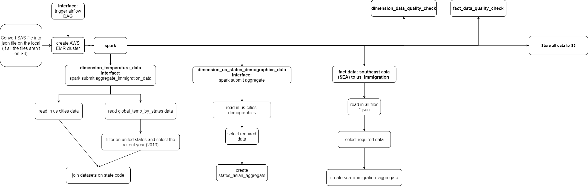
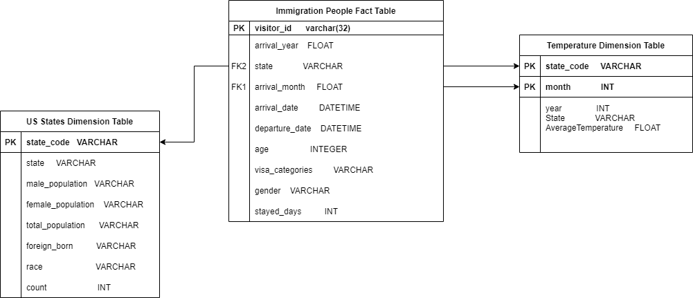
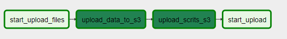
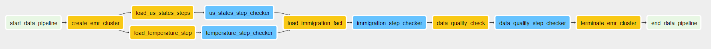

# CAPSTONE PROJECT | TIN DO

## Airflow Pipeline + Spark + AWS EMR + Docker to Build the Dataset of US Immigration, Temperature and Demographic of Each State

### Project Overview

The fact table containing the people going to the US by airplane is extracted from the immigration data of US goverment. And, two dimension tables of temperature and demographic of every US state are created to support the fact table. From this dataset, the dataset is analyzed to provide the high level result such as:

* What states are the most visited states
* What are the peak immigration periods
* The relationship between the temperature and the immigration

The project uses spark for data processing and airflow to monitor the entire procedures of the project. Because the data is huge, the data processing is on the AWS EMR through the spark submit from the client or local machine. The final dataset will be sent to the AWS S3.


### Use Cases

- The data can be used to study the impact of temperature having on the population of each states. The further analysis is the further impact by gender on each state.
- The analysists can use data to determine the types of visas that commonly used, how long the people stay in each states that is impacted by the temperature. The impact of temperature on the rate on immigration by city.

### Queries

- Find the average immigration trafiic at a given state by month.
- Find the average ages of immigrants at given state by month.
- Find the total numbers of imcoming immigratnts for the given states by month.

### App Architecture



### Datasets

- **I94 Immigration Data**: This data comes from the US National Tourism and Trade Office. You can read more about it [here](https://travel.trade.gov/research/reports/i94/historical/2016.html)
- **World Temperature Data**: This dataset came from Kaggle. You can read more about it [here](https://www.kaggle.com/berkeleyearth/climate-change-earth-surface-temperature-data).
- **U.S. City Demographic Data**: This data comes from OpenSoft. You can read more about it [here](https://public.opendatasoft.com/explore/dataset/us-cities-demographics/export/).

### Data Model

The data model is the star schema with the fact table `immigration_people` and dimension tables namely `temperature_dimension` and `us_states_dimension`. The reason for this model because I found the relationship between the different datasets which have a common keys are time and states. It is also optimized for OLAP (Online Analytical Processing) operations. All the result data will be stored on S3 bucket.



### Tools and Technologies

- **Apache Spark** - It was needed to convert the large data SAS to json data files. From json data files and csv files, spark will process data and maps the columns from the datasets to the relevant columns for the data models.
- **Apache Airflow** - It was required to automate workflows. It will uploads the data and scripts files from local filesystem to s3, create the AWS EMR cluster and submit scripts files to process data on the AWS EMR. Finally, it will store final data to S3 bucket and terminate the AWS EMR when tasks are completed.
- **Docker** - It will install the required Apache Airflow on the container of the Docker space. So the users won't care much about how to setup the Apache Airflow configuration.
- **Amazon S3** - Stores all datasets, scripts files and the final data model.
- **Amazon EMR** - The datasets are large to be processed on the local machine. It is needed for the powerful remote cluster to handle all the process of data.

### DAGs Airflow Graph

**Upload Data to S3 DAG**


**Capstone DAG**


### Setup

#### Prerequisites

1. [Docker](https://docs.docker.com/get-docker/) (also docker-compose). The [docker-airflow](https://github.com/puckel/docker-airflow) is used to set up the Apache Airflow
2. [git](https://git-scm.com/book/en/v2/Getting-Started-Installing-Git) to clone the starter repo
3. [AWS account](https://aws.amazon.com/) to set up required cloud services.
4. [Install](https://docs.aws.amazon.com/cli/latest/userguide/install-cliv2.html) and [configure](https://docs.aws.amazon.com/cli/latest/userguide/cli-configure-quickstart.html#cli-configure-quickstart-config) AWS CLI on your machine
5. [pyspark](https://pypi.org/project/pyspark/)  to run the [Apache Spark](https://spark.apache.org/) program.

Check for presence of the `EMR_EC2_defaultRole` and `EMR_DefaultRole` default role as shown below.
```
$ aws iam list-roles | grep 'EMR_DefaultRole\|EMR_EC2_DefaultRole'
```

If the roles does not present, create them using the following command
```
$ aws emr create-default-roles
```   
The project will need Amazon S3 buckets that is created before starting the project. To create S3 bucket, you can go to [AWS account](https://aws.amazon.com/) to sign in and go to S3 section to create bucket. The name of S3 bucket is required as `input-data-project` and `output-data-project` to run the project. If you can't create with that name, you can create your own name of S3 bucket and change the constant variable `BUCKET_NAME` and `INPUT_PATH` for all python files in **scripts** folder.

Another way to create Amazon S3 bucket is using [AWS S3API CLI Command](https://docs.aws.amazon.com/cli/latest/reference/s3api/create-bucket.html)
```
$aws s3api create-bucket --bucket name-bucket --region us-west-1 --create-bucket-configuration LocationConstraint=us-west-1
```    
You can change the region of S3 Bucket by changing the `us-west-1` to other region.

#### Clone repository

Clone the repo from github by running:
```
$ git clone git@github.com:
```

#### Steps to Generate Data to Upload to S3 Bucket

1. Create directories `./data/dimension-data` and `./data/immigration-data`.

2. Retrieve the `GlobalLandTemperaturesByState.csv` from [Kaggle](https://www.kaggle.com/berkeleyearth/climate-change-earth-surface-temperature-data) and the `us-cities-demographics.csv` from [OpenSoft](https://public.opendatasoft.com/explore/dataset/us-cities-demographics/export/), then store them into directory `data/dimension-data`.

3. Create directories `./raw_sas_data`. Pull the Immigration files in SAS format from the [source](https://travel.trade.gov/research/reports/i94/historical/2016.html) to the `raw_sas_data` directory. Then run the following command

```
$ python convert_data_to_json.py
```

It will run the spark program to convert the SAS format files into the json files that store in the directories that have the name of SAS files. These directories are stored in directory `data/immigration-data`.

#### Run the Airflow DAG

On the terminal, run the following command to start Apache Airflow

```
$ sh init-project.sh
```

It will setup the services to run Apache Airflow locally. Wait a few minutes and go to http://localhost:8080/admin/ and turn on `upload_file_to_s3_dag` DAG which upload all data to S3. After this DAG is completed, turn on `immigration_project_dag` DAG which aggregate data and upload to S3. The DAG takes a while to complete since the datasets are huge (~7.0 GB). All the DAGs are set to run monthly.

After all DAGs were completed, to turn off the local Airflow instance as shown below

```
$ sh shutdown-airflow.sh
```

**Note**: If your job fails or you stop Airflow instance make sure to check your AWS EMR UI console to terminate any running EMR cluster.

### Suggestion for Data Update Frequency

The data should be updated daily or montly, so the data model is always updated for every month for all datasets in order to increase the accurate analysis.

### Possible Scenarios and How to handle them

- If data gets increased by 100x:
    - We can increase the compute nodes to read and write the database.
    - Another possible tool is [Amazon Athena](https://aws.amazon.com/blogs/aws/amazon-athena-interactive-sql-queries-for-data-in-amazon-s3/) so we can directly analyze the data inside Amazon S3.
    - Compress the S3 data.
    
- If the pipelines would be run on a daily basis by 7 am every day:
    - DAGs can be scheduled to run daily by setting the `schedule_interval` to @daily and set `start_date` to 7 AM.

- If the database needed to be accessed by 100+ people:
    - The database can be shifted to Redshift so we can utilize Concurrency Scalling on Redhift to increasing amount of users.